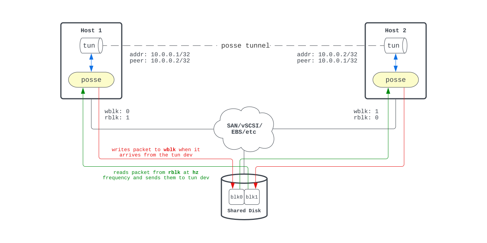
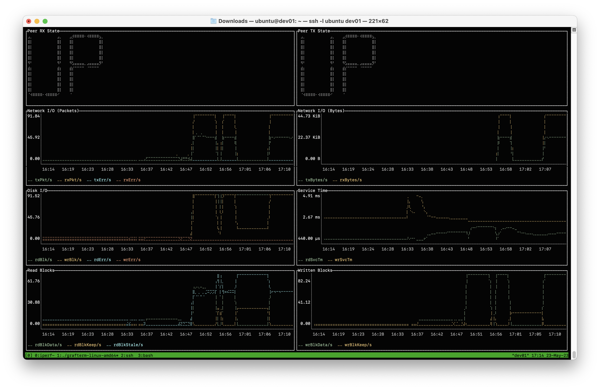

# posse - Packets Over Shared StoragE

This is an experimenal tool that allows IP communication between two hosts through a shared storage device, which could be a FC or iSCSI LUN mapped to both hosts, or a virtual disk that is attached to two VMs, such as a multi-writer shared disk in VMware vSphere or an EBS Multi-Attach disk in AWS.

It is uncertain what are the the optimal use cases for this tool at present. However, it is possible that it could serve as an additional out-of-band link in high availability (HA) environments to better manage network isolation incidents, or circumvent restrictive firewalls.

It is anticipated that there may be instances of packet drops and other minor interruptions, although low-traffic applications such as SSH are currently functioning properly.

## Working Principle

This tool creates a TUN interface and writes incoming packets to a designated disk at a specified block number (`wblk`). Simultaneously, it polls the other designated block (`rblk`) for changes and writes them to the TUN interface.



## Example

```
host1# posse --disk /dev/sdb --wblk 0 --rblk 1 --addr 10.0.0.1/32 --peer 10.0.0.2/32
host2# posse --disk /dev/sdb --wblk 1 --rblk 0 --addr 10.0.0.2/32 --peer 10.0.0.1/32
host1# ping 10.0.0.2
PING 10.0.0.2 (10.0.0.2) 56(84) bytes of data.
64 bytes from 10.0.0.2: icmp_seq=1 ttl=64 time=136 ms
64 bytes from 10.0.0.2: icmp_seq=2 ttl=64 time=140 ms
64 bytes from 10.0.0.2: icmp_seq=3 ttl=64 time=145 ms
^C
```

## Options

- `disk` - Path to disk used for sending and receiving packets. It is important to exercise caution when using this disk, as any data on it may be overwritten. Env var `DISK`. Required.
- `tun` - Tunnel device name. Env var `TUN`. Optional.
- `addr` - Local IP address for tunnel. Must be equal to `peer` value on the remote host. Env var `ADDR`. Required.
- `peer` - Remote IP address for tunnel. Must be equal to `addr` value on the remote host. Env var `PEER`. Required.
- `rblk` - Disk block number to read packets from. Must be equal to `wblk` value on the remote host. Env var `RBLK`. Required.
- `wblk` - Disk block number to write packets to. Must be equal to `rblk` value on the remote host. Env var `WBLK`. Required.
- `txqlen` - Transmit queue length. Env var `TXQLEN`. Optional. Defaults to 16.
- `rxqlen` - Transmit queue length. Env var `RXQLEN`. Optional. Defaults to 16.
- `hz` - Frequency in Hz at which the disk writing and reading operations are performed. Must be equal to `hz` value on the remote host. Env var `HZ`. Optional. Defaults to 10.
- `promaddr` - Addr:port to listen on for prometheus queries. Env var `PROMADDR`. Optional. Defaults to '' (feature disabled).
- `maxstale` - Number of stale reads before declaring peer dead. Env var `MAXSTALE`. Optional. Defaults to 5.

## Performance
The bandwidth is effectively limited by the frequency of transfers, which is set to 10 per second by default (see the `hz` flag). This value can be safely increased to 100 on most systems. The maximum feasible value for your configuration can be calculated by dividing 1000 by your shared disk response time in milliseconds. For example, if your disk has a response time of 5 ms, the `hz` flag can be set to 200.

It is also recommended to change the TCP congestion control algorithm to BBR on both hosts:
```
# sysctl -w net.ipv4.tcp_congestion_control=bbr
# sysctl -w net.core.default_qdisc=fq
```

Posse can transfer data at a rate of approximately 45 kilobytes per second at a frequency of 100 Hertz.

## Monitoring

Posse can export metrics to Prometheus. The `examples` directory contains a sample configuration files for Prometheus and [Grafterm](https://github.com/slok/grafterm).



## Docker support
Posse can be run in a containerized environment. For more information, please refer to the included Dockerfile and docker-compose.yml files.